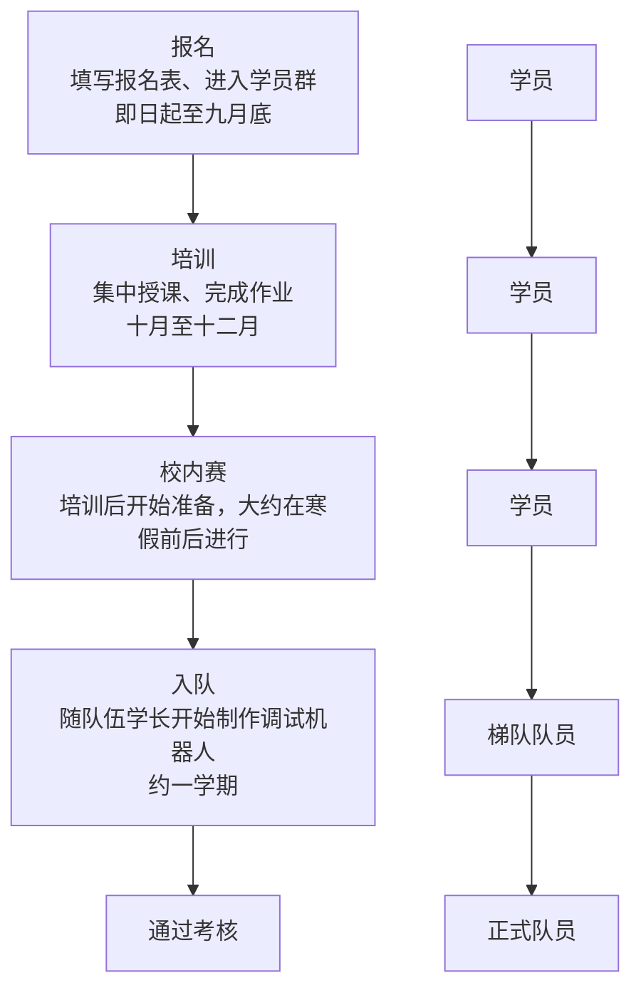

# 常见问题
::: info 说明
招生期有些问题问的比较多，所以直接把主页跳转到这个页面了
:::

<!--## 比赛周期和精力投入
> 需要多久备赛？

与电赛和各类PPT比赛（挑战杯、互联网+等）不同，RM的比赛周期极长，基本没有空窗期，即整年都在备赛。一般队员竞赛生涯是两年半到三年，即大一开学到大三下的三四月（联盟赛）或者五六月（对抗赛）

比赛期间的精力投入较大，尤其是在赛前半个月到一个月时间

::: tip 说明
有些人极度热爱该比赛，甚至有 **“十年老兵”** 的存在
:::-->

## 介绍
RoboMaster机甲大师是由大疆主办的机器人比赛，覆盖全球三百多所高校，分为多个项目，主要内容是制造机器人并进行射击对抗

自2013年起的十多年起，数万名优秀的前辈为了热爱而不断突破赛事技术的高峰

赛事规格较高，操作对抗的元素和赛场上的变数还使得它有了一定的电竞属性。比赛在大型体育馆举办，有专业解说（前几年大疆请了LPL解说），有全程直播，每年还会拍摄一季纪录片，可以说是圆了很多人的机甲梦和电竞梦

可以看看[这个视频](https://www.bilibili.com/video/BV1oP41117f1)了解一下这个比赛十多年来的历史，或者去[官方b站](https://space.bilibili.com/20554233/channel/collectiondetail?sid=1572868)看看往期比赛

## 我们的目标
每年的国赛、复活赛在深圳湾春茧体育馆举办，因此，去春茧、去捧起那个金色的机械手奖杯，成了每个RMer的梦想

至今共有成电、华工、东大、上交四个学校获得过全国总冠军。从2025赛季开始我们也将参与到超级对抗赛中，获得更好的成绩，争取晋级名额

## 有什么好处？
我们与学生会、团委等学生组织还有小挑、大创这些演示类的竞赛不同，它们更多是对奖学金、综测等学校内部的奖励机制有帮助

而加入我们主要是学技术，有利于个人发展和未来求职

我不能说所有人都应该选择某一条路，主要还是看你的个人追求。或者说，你想成为怎样的人？

::: danger 警告
不要抱着功利心态来，我们只能培养技术能力，你只能获得技术成长带来的好处
:::

在大学生竞赛中，该比赛可以说是技术要求最高，备赛时间和比赛周期最长的，但毫无疑问对能力培养也是最有利的。

造出一台技术力较高、创新点较多的车，甚至可以作为几个人的毕业论文。

## 时间安排

## 入队要求
我们的培训课程大致是每周一次，布置一些任务在课后完成，需要的时间因人而异，但不会占用过多的时间，更多还是看个人的安排

成为正式队员时，我们只要求完成培训内容且技术达标，对人数等没有硬限制，不用过度担心，绝大多数退出的学员都是自己选择退出

## 组别介绍
正式开始培训前我们会讲一些关于组别选择的内容，也可以同时参与多个组的培训

还有一些非技术岗位可选择

### 宣传、运营、财务等
如组名所述，负责一些非技术类的岗位，对其他队员们开展工作起关键支撑作用
### 算法组
目标识别、环境感知、自主决策导航等算法的应用
### 电控组
嵌入式算法编写和调试
### 机械组
机器人机械结构设计及制造
### 硬件组
电路板和线路的设计、制造和调试

## 电脑
> 需要什么样的电脑？

> 我的xx型号电脑够不够用？

> 有没有推荐的笔记本型号

如果只买一台笔记本，那就不要考虑轻薄本了，尤其不要买macbook，尽量选游戏本，近几年的都可以满足要求

机械组用性能差的电脑画图会非常难受，电控和算法要求低一点，但还是建议尽量买高性能的机器

在此前提下，这些问题的答案主要取决于你的预算，建议参考[这篇文章](https://mp.weixin.qq.com/s/MCik0S8y3K47AZV_4P6YKQ)

::: danger 省流版
简单说得话，建议买拯救者、天选、游匣、神舟、机械革命等游戏本，实力允许的还可以考虑ROG、外星人

不建议买MacBook、联想小新、华为MateBook等轻薄本，除非有足够买两台电脑的预算
:::

<!--
如果只买一台笔记本，那就不要考虑轻薄本了，尤其不要买macbook，近几年的主流配置的全能本和游戏本基本可以满足要求

个人认为，高性能台式机+便携长续航笔记本是比较舒服的搭配

算法组（尤其是训练模型时）会要求你的电脑有nvidia的显卡，但如果没有也可以用实验室的资源

> 有没有推荐的笔记本型号

这个问题的答案极大地取决于你的预算

建议打开微信，搜索公众号“笔吧评测室”，点自主选机-选购指南，根据预算区间选择最适合你的电脑

~~广告费结一下~~
-->

## 软件
> 需要下什么软件吗？

需要，但不急，各组会使用不同的专业软件，对应培训安排时会详细教授

如果想开始提前学的，算法和电控教程已放在该网站上，机械和硬件的咨询组长